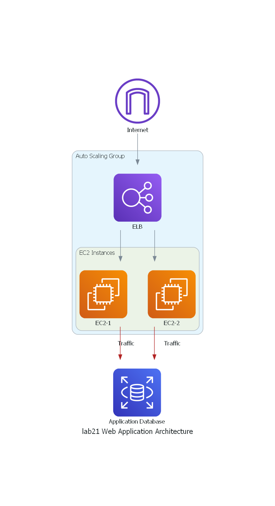

# Lab 21: Web Application

## Cross-Plane AWS Architecture Diagram

### Overview
Creating a crossplane configuration for the given architecture and set it up for deployment for two teams is crucial for understanding how various AWS services collaborate to support a web application. This document provides a simplified example of such a diagram for a basic web application hosted on AWS.

### Logical Architecture Diagram

#### Explanation of Components:

1. **Internet:**
   - Represents the public internet where users access your application.

2. **Elastic Load Balancer (ELB):**
   - Acts as a load balancer distributing incoming traffic across multiple EC2 instances.
   - Enhances high availability and scalability.

3. **Auto Scaling Group (ASG):**
   - Manages a group of EC2 instances.
   - Automatically scales the number of instances based on traffic demand for optimal performance.

4. **EC2 Instances:**
   - Virtual servers in the AWS cloud running your web application.
   - Multiple instances for redundancy and scalability.

5. **Web Server:**
   - Software component running on EC2 instances serving your web application.

6. **Application Database:**
   - Stores your application's data.
   - Can be an RDS instance, Aurora, or another database service.

### Workflow

1. User accesses the web application through the Internet.

2. The Elastic Load Balancer distributes the traffic across multiple EC2 instances.

3. The Auto Scaling Group ensures the right number of instances, adjusting capacity based on traffic.

4. Each EC2 instance runs a web server serving the application.

5. EC2 instances connect to a shared application database for data storage.

