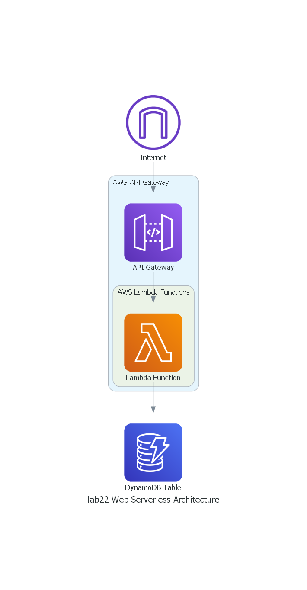

# Lab 22: Serverless Architecture
Creating a crossplane configuration for the given architecture and set it up for deployment for two teams involves representing an application or system that relies heavily on AWS Lambda, AWS API Gateway, and other serverless services. 

### Logical Architecture Diagram

## Explanation of Components:

- **Internet:** Represents the public internet where clients make requests to your serverless application.
- **AWS API Gateway:** Acts as a front-end service to your serverless application, handling HTTP requests and routing them to AWS Lambda functions. It also provides features like authentication and rate limiting.
- **AWS Lambda Function:** Serverless compute functions that execute code in response to incoming requests. These functions are event-driven and can perform various tasks, such as processing data, running business logic, or interacting with other AWS services.
- **DynamoDB Table:** A NoSQL database service provided by AWS. It can be used to store and retrieve data for your serverless application. Lambda functions can interact with DynamoDB for data storage and retrieval.

### Workflow

1. Clients make requests to your application through the AWS API Gateway.
2. The API Gateway forwards requests to the appropriate AWS Lambda function(s) based on the configured endpoints and HTTP methods.
3. AWS Lambda functions execute the code, which may include processing, data retrieval from DynamoDB, and other tasks.
4. DynamoDB stores and retrieves data as needed by your Lambda functions.

### Additional Notes

This serverless architecture provides a highly scalable and cost-effective solution for handling various types of workloads. It automatically scales based on incoming requests, and you only pay for the compute resources used during the execution of Lambda functions.
