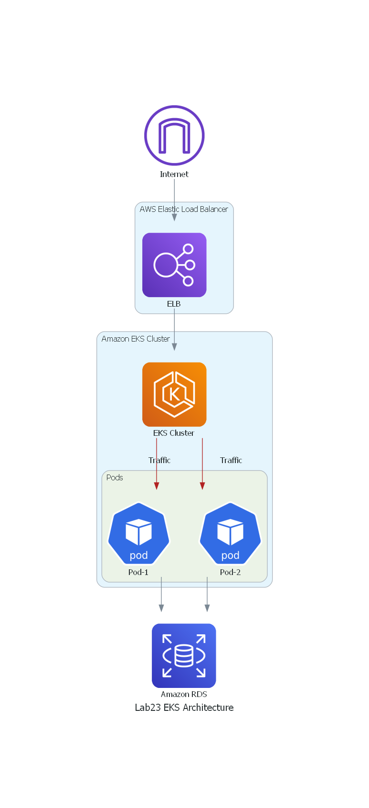

# Lab 23: Kubernetes

Creating a crossplane configuration for the given architecture and set it up for deployment for two teams that incorporates Amazon Elastic Kubernetes Service (EKS) and Amazon RDS (Relational Database Service) provides a more traditional containerized microservices approach with managed database storage. 

### Logical Architecture Diagram

## Explanation of Components:

- **Internet:** Represents the public internet where users access your services.
- **AWS Elastic Load Balancer (ELB):** Acts as a load balancer that distributes incoming traffic across multiple pods in your EKS cluster. ELB helps with high availability and scalability.
- **Amazon EKS Cluster:** A managed Kubernetes cluster that orchestrates containerized applications using Kubernetes. It manages the deployment and scaling of containers across multiple worker nodes.
- **Pods:** Kubernetes pods are the smallest deployable units in an EKS cluster. Each pod can contain one or more containers. In this diagram, multiple pods are deployed within the EKS cluster.
- **Containers:** These are individual application components that run within the pods. Containers hold your application code and dependencies.
- **Amazon RDS:** A managed relational database service provided by AWS. It can be used for storing and retrieving structured data. This can be an RDS instance running a database engine such as MySQL, PostgreSQL, or others.

### Workflow

1. User requests come through the internet and are distributed by the Elastic Load Balancer (ELB) to different pods within your EKS cluster.
2. Each pod can host one or more containers. These containers run your application code and can communicate with each other as needed.
3. The application components within the containers may interact with Amazon RDS to read or write data, depending on your application's requirements.

### Additional Notes

This architecture is suitable for applications with containerized microservices that require orchestration, scalability, and the use of a managed relational database.

Please note that setting up an EKS cluster and managing Kubernetes requires careful configuration and administration. Additionally, the choice of RDS engine and its configuration (e.g., security, scaling options) will depend on your specific application needs. The actual architecture may be more complex and include additional services like caching (e.g., Amazon ElastiCache), message queues (e.g., Amazon SQS), and more, depending on your application's requirements.