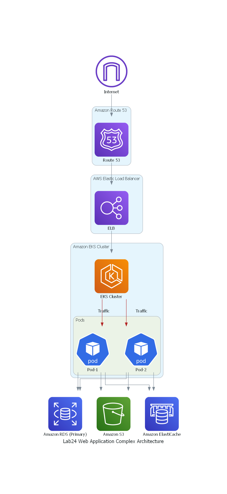

# Lab 24: Complex Architecture

Creating a crossplane configuration for the given architecture and set it up for deployment for two teams involving Amazon Elastic Kubernetes Service (EKS) and Amazon RDS, along with additional AWS services, is a challenging task. Here's a more advanced architecture that represents a multi-tiered, highly available, and scalable web application

### Logical Architecture Diagram

### Explanation of Components:

- **Internet:** Represents user access to your web application.
- **Amazon Route 53:** DNS service for routing traffic to AWS resources.
- **AWS Elastic Load Balancer (ELB):** Distributes incoming traffic across multiple pods in your Amazon EKS cluster. Provides high availability and scalability.
- **Amazon EKS Cluster:** Managed Kubernetes cluster for orchestrating containerized applications.
- **Pods:** Kubernetes pods containing containers that run your application components.
- **Containers:** Individual application components running within pods.
- **Application Server:** Represents the application logic within containers.
- **Amazon RDS (Primary):** Managed relational database service, set up with multi-AZ (Availability Zone) configuration for high availability and automatic failover.
- **Amazon ElastiCache:** Managed in-memory caching service for caching frequently accessed data to improve application performance.
- **Amazon S3:** Object storage service used for storing static assets such as images, stylesheets, and JavaScript files.

### Workflow

1. User requests are routed through Amazon Route 53, which directs traffic to the Elastic Load Balancer (ELB).
2. The ELB balances traffic across multiple pods in the EKS cluster, ensuring high availability and scalability.
3. Within each pod, containers run the application logic, and they can communicate with each other as needed.
4. The application may utilize Amazon RDS as the primary database for structured data storage. The multi-AZ setup ensures high availability and data redundancy.
5. Amazon ElastiCache is used for caching frequently accessed data, reducing the load on the database and improving response times.
6. Static assets are stored in Amazon S3, providing a scalable and cost-effective solution for serving static content.

### Additional Notes
This architecture is suitable for a complex, production-grade web application that requires high availability, scalability, and a managed database solution. However, implementing and maintaining such an architecture can be challenging, and it may involve additional considerations for security, monitoring, and disaster recovery.

